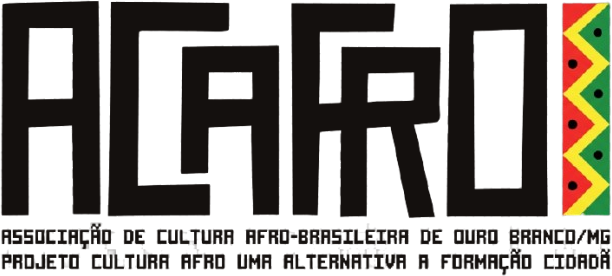

# Marca ACAFRO

| Arquivo | Uso |
|---|---|
| [`logo-acafro.png`](logo-acafro.png) | Lettering **branco**, fundo transparente — para superfícies escuras |
| [`logo-acafro-escura.png`](logo-acafro-escura.png) | Lettering **quase-preto** (`#14100E`), fundo transparente — para superfícies claras |

Ambas 612 × 276 px, recortadas no limite do conteúdo. A variante escura foi gerada a
partir da clara, recolorindo só os pixels do lettering — a faixa em zigue-zague mantém as
cores originais nas duas.

## Paleta

Cores amostradas diretamente dos pixels da logo.

| Cor | Hex | Uso |
|---|---|---|
| Preto | `#14100E` | Lettering na variante escura, fundos, textos |
| Vermelho | `#E52B22` | Acento e alerta |
| Amarelo | `#EFE62E` | Atenção |
| Verde | `#0F8F33` | Confirmação |

As três cores vêm do zigue-zague à direita do lettering — são as cores pan-africanas,
elemento identitário da marca. No protótipo elas aparecem **pontualmente**: eyebrows,
ponto final dos títulos, pills de status e a régua de acento.

## Linguagem visual

A estrutura de design vem de [`../branding/identidade-visual-cultural1`](../branding/identidade-visual-cultural1)
— proposta inicial da equipe, em Next.js. É uma linha editorial e quente: display
serifado (Fraunces) em peso 400 com tracking negativo, texto em DM Sans, eyebrows em caixa
alta espaçada, painéis de borda suave e raio 10, sidebar escura de 248px.

O protótipo mantém essa estrutura e substitui a paleta terracota/ocre original pelas cores
da logo da ACAFRO, preservando os papéis: primária = vermelho, acento = amarelo/ouro,
secundária = verde, escuro = quase-preto, fundo = areia.

## Cuidados

- **Escolha a variante pelo fundo.** Clara sobre escuro, escura sobre claro. Nunca ponha
  a variante clara sobre fundo claro — o lettering branco some.
- Nada de caixa branca atrás da logo: as duas versões têm fundo transparente e assentam
  direto na superfície.
- O lettering é pesado e condensado. Não substitua por fonte fina.
- Ainda vale pedir ao cliente uma **versão vetorial** (SVG/AI/EPS), para impressão e
  para tamanhos grandes sem perda.
