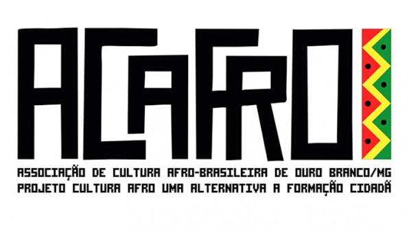

# Marca ACAFRO

Arquivo: [`logo-acafro.jpeg`](logo-acafro.jpeg) — 596 × 335 px, fundo branco.
Recebido do cliente em 27/08/2026.

## Paleta

Cores amostradas diretamente dos pixels da logo.

| Cor | Hex | Uso |
|---|---|---|
| Preto | `#0D0D0D` | Lettering, fundo da área restrita, textos |
| Vermelho | `#E52B22` | Destaque primário, alertas, CTA |
| Amarelo | `#EFE62E` | Destaque secundário, marcações |
| Verde | `#0F8F33` | Confirmação, presença, WhatsApp |
| Branco | `#FFFFFF` | Fundo |

As três cores vêm do padrão em zigue-zague à direita do lettering — são as cores
pan-africanas, elemento identitário da marca, não decoração. No protótipo elas aparecem
como faixa gráfica recriada em CSS, seguindo o mesmo motivo.

## Linguagem visual

A estrutura de design vem de [`../branding/identidade-visual-cultural1`](../branding/identidade-visual-cultural1)
— proposta inicial da equipe, em Next.js. É uma linha editorial e quente: display
serifado (Fraunces) em peso 400 com tracking negativo, texto em DM Sans, eyebrows em caixa
alta espaçada, painéis de borda suave e raio 10, sidebar escura de 248px.

O protótipo mantém essa estrutura e substitui a paleta terracota/ocre original pelas cores
da logo da ACAFRO, preservando os papéis: primária = vermelho, acento = amarelo/ouro,
secundária = verde, escuro = quase-preto, fundo = areia.

## Marca derivada

Para uso em interface foi desenhada uma marca a partir do zigue-zague da logo:
[`../prototipo/assets/marca.svg`](../prototipo/assets/marca.svg). Traço em `currentColor`
com três pontos nas cores da ACAFRO — herda a cor do contexto e dispensa a caixa branca.
Acompanha um padrão de repetição (`padrao.svg`) para fundos.

**Regra de uso:** a logo original aparece no máximo uma vez por tela, como peça
institucional. Em cabeçalhos, rodapés e navegação, usa-se a marca derivada com o wordmark.

## Cuidados

- A logo tem **fundo branco sólido**, não transparente. Sobre fundo escuro, use um bloco
  branco atrás dela — não tente recortar.
- O lettering é pesado e condensado. Não substitua por fonte fina.
- Pedir ao cliente uma versão vetorial (SVG/AI/EPS) e uma versão com fundo transparente.
